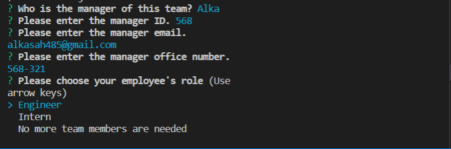

## 10 Object-Oriented Programming: Team Profile Generator

## Project Description

The Team Profile Generator is a command-line-input application run in Node that requests information from the user about members of an engineering team and generates an HTML file displaying that information. Before running the application the user must perform an npm install to install all required dependencies.

Upon launching the app user is asked to enter the name, mail, id and officenumber of their manager. After that the user is asked to select other team member from a list(options include "Engineer","Intern"),enters the member's email address, and then must enter another piece of information that will differ depending on what role was selected. If "Engineer" was selected, the app asks the user for the team member's GitHub username; if "Intern" was selected, the member's school is requested.

A screenshot showing an example of user input is shown below:

When all information on the team member has been entered, the user is asked whether there are any more members they would like to add. If so, the user is asked the same questions about the new team member. If not, an HTML file is created with cards displaying the information on all the team members entered by the user in the "outputs" folder titled "team.html." A screenshot of an example team profile is shown below:

# Video of running application

https://drive.google.com/file/d/12RUuO5ngYswSnTC9Ts_MrSaPtGdJh1UP/view

## Techniques and Technologies Used

This app was created using Object-Oriented Programming concepts, namely using classes and constructors to create "team member" objects based on information entered by the user. The app is run using Node.js, and uses the "Inquirer". Files for different objects are also stored in separate .js files and passed among one another using module.exports and require.

This app uses concepts from Test-Driven Development. Jest is used to perform tests on all the class constructors to ensure that they behave as expected.

